# LLM Task Recovery

A research framework studying how Large Language Models can serve as real-time recovery planners for reinforcement learning agents when runtime anomalies disrupt task execution.

Trained RL agents (PPO / LSTM-PPO) navigate grid-world environments to complete tasks such as pick-and-deliver, patrol, and search-and-retrieve. When an anomaly is detected at runtime — a path becomes obstructed, an object is displaced, or a goal is invalidated — an LLM recovery planner proposes a new waypoint and guides the agent back on track. A task arbiter mediates between the base RL policy and the LLM recovery signal.

## System Overview

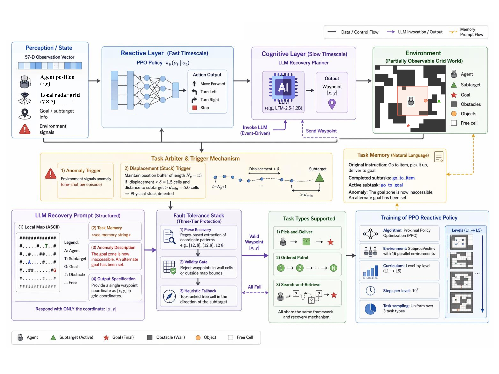

## Results

### Baseline performance across map levels


### Anomaly type comparison


### Task memory ablation


### No-anomaly control


### Multi-task generalization
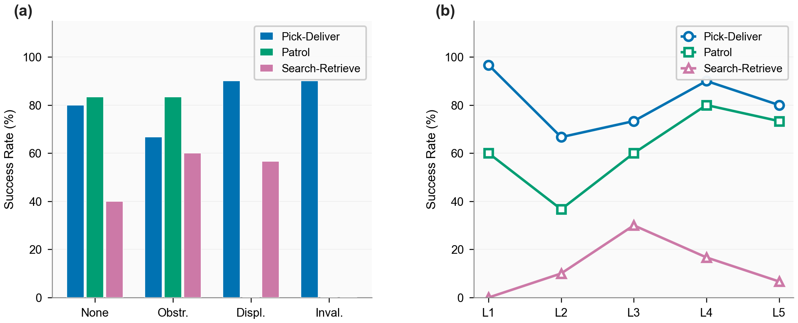

### LLM model comparison
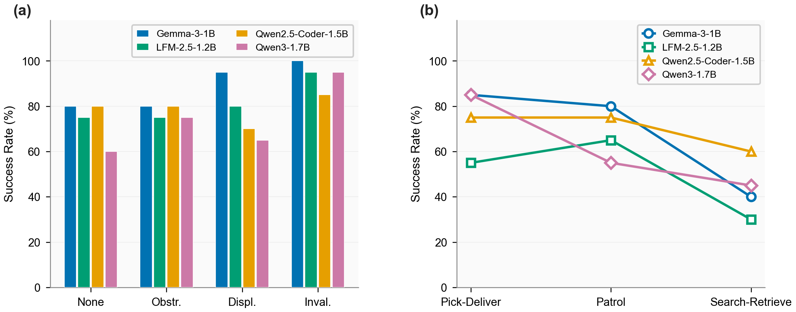

### Trigger ablation
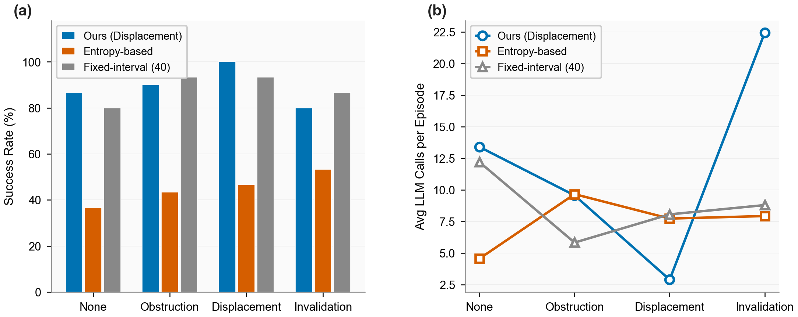

### Edge deployment
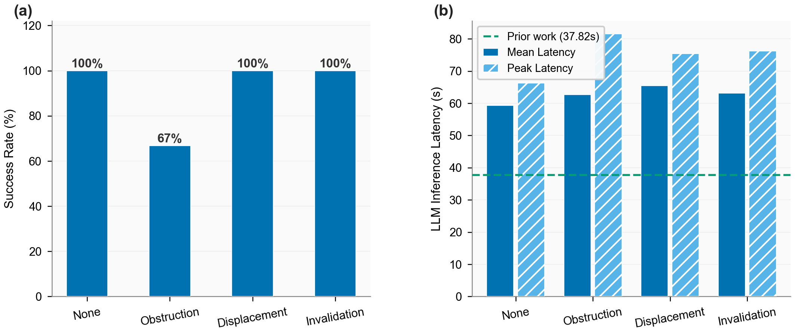

### Noise intervention
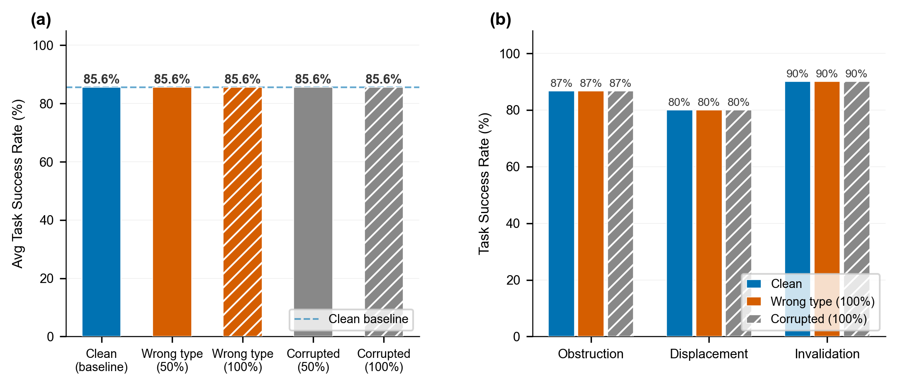

### LLM baselines
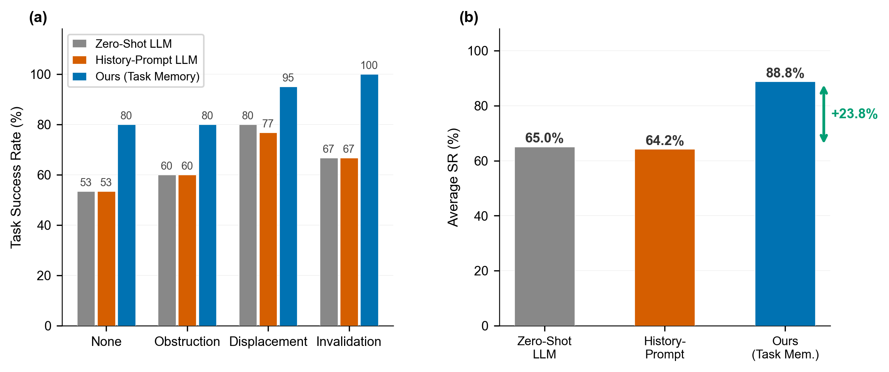

### A* baseline
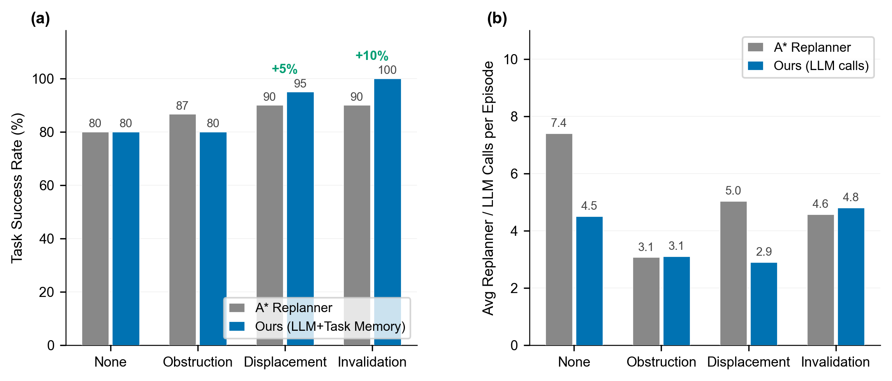

### CoT baseline
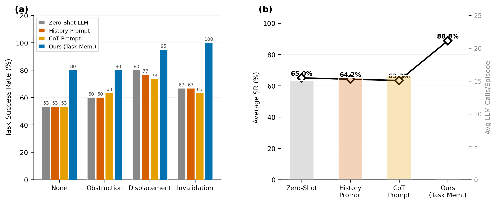

### Anomaly injection timing
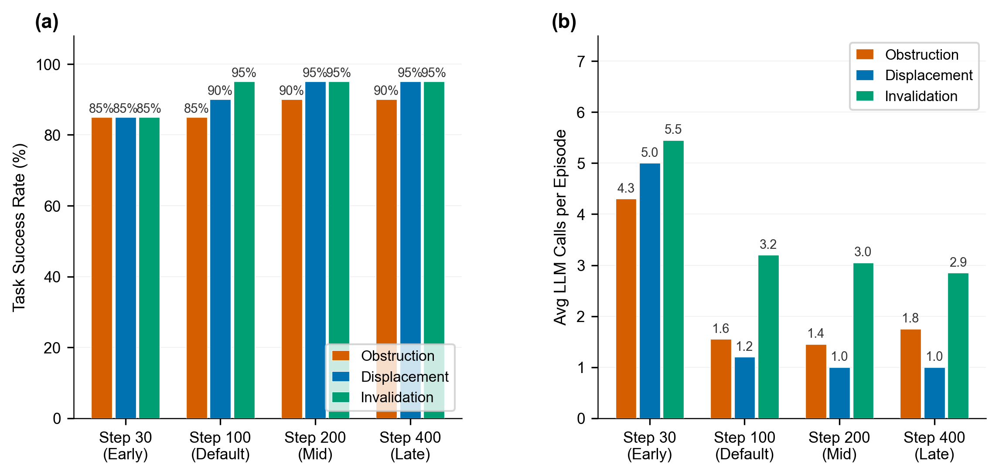

### Multi-task baseline
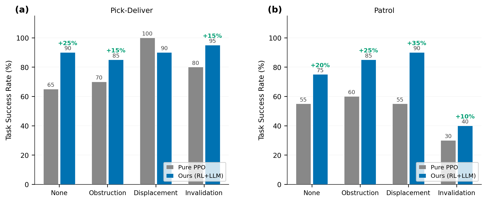

### Map visualization — all levels
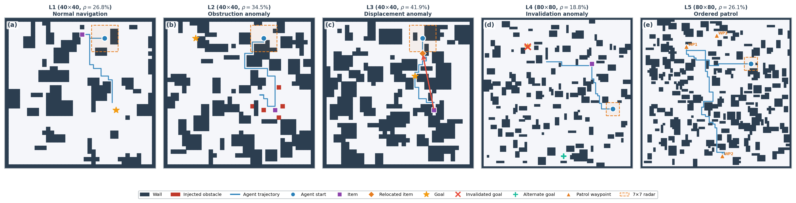

### Map visualization — recovery
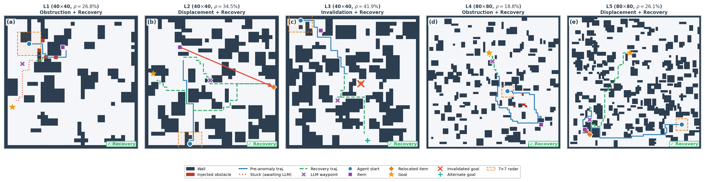

---

## Project Structure

```
llm_task_recovery/
├── envs/                          # Gymnasium environment
│   ├── task_env.py                # 3 task types, 5 map levels
│   ├── anomaly_injector.py        # Runtime anomaly injection
│   └── map_generator.py           # Procedural map generation
│
├── models/                        # Core model modules
│   ├── llm_recovery.py            # LLM-based waypoint planner
│   ├── arbiter.py                 # RL ↔ LLM handoff logic
│   └── task_memory.py             # Task memory module
│
├── experiments/                   # Experiment scripts
│   ├── exp_astar_baseline.py
│   ├── exp_injection_timing.py
│   ├── exp_llm_ablation.py
│   ├── exp_llm_baselines.py
│   ├── exp_multitask_baseline.py
│   ├── exp_nlp_model_comparison.py
│   ├── exp_noise_intervention.py
│   ├── exp_react_baseline.py
│   ├── exp_search_only.py
│   └── exp_trigger_ablation.py
│
├── train/                         # LSTM-PPO training scripts
│   ├── train_lstm.py
│   └── train_lstm_fair.py
│
├── eval/                          # LSTM-PPO evaluation scripts
│   ├── eval_lstm.py
│   ├── eval_lstm_fair.py
│   └── eval_lstm_llm.py
│
├── scripts/                       # Shared utilities
│   ├── train.py                   # PPO training
│   └── evaluate.py                # Evaluation helpers
│
├── data/maps/                     # Pre-generated map CSVs (L1–L5)
├── results/                       # Experiment output JSONs
├── figures/                       # Paper figures (PNG)
├── models_saved/                  # Final trained model weights
│
├── edge_deploy.py                 # Edge deployment (quantized inference)
├── record_episode.py              # Episode recorder
├── run_all.py                     # Main pipeline entry point
└── requirements.txt
```

## Setup

**Requirements:** Python 3.11+, [LM Studio](https://lmstudio.ai/) for local LLM inference.

```bash
pip install -r requirements.txt
```

The LLM recovery module connects to a local OpenAI-compatible server at `http://127.0.0.1:1234/v1` by default (LM Studio). Any compatible model works; experiments in this project used models in the 1–2B parameter range: Gemma 3 1B, Qwen2.5-Coder 1.5B, Qwen3 1.7B, and LFM2.5 1.2B.

## Training

Train standard PPO agents across all map levels:

```bash
python scripts/train.py
```

Train LSTM-PPO variants:

```bash
python train/train_lstm.py
python train/train_lstm_fair.py   # fair comparison variant
```

Pre-trained model weights are stored in `models_saved/`.

## Running Experiments

Run the main pipeline (search-only + ReAct baselines):

```bash
python run_all.py
```

Run individual experiments:

```bash
python experiments/exp_astar_baseline.py        # A* pathfinding baseline
python experiments/exp_llm_baselines.py         # LLM prompt strategy comparison
python experiments/exp_nlp_model_comparison.py  # Compare different LLMs
python experiments/exp_react_baseline.py        # ReAct-style prompting
python experiments/exp_search_only.py           # Search-only ablation
python experiments/exp_trigger_ablation.py      # Anomaly trigger ablation
python experiments/exp_injection_timing.py      # Injection timing study
python experiments/exp_noise_intervention.py    # Noise robustness
python experiments/exp_multitask_baseline.py    # Multi-task generalization
python experiments/exp_llm_ablation.py          # LLM component ablation
```

Evaluate LSTM models:

```bash
python eval/eval_lstm.py
python eval/eval_lstm_fair.py
python eval/eval_lstm_llm.py
```

## Environment Details

The task environment (`envs/task_env.py`) supports three task types across five map complexity levels:

| Task | Description |
|------|-------------|
| `pick_deliver` | Navigate to item, then deliver to goal |
| `patrol` | Visit a sequence of waypoints in order |
| `search_retrieve` | Find item at unknown location, return to base |

| Level | Grid size | Description |
|-------|-----------|-------------|
| L1–L3 | 10×10 | Simple to moderate layouts |
| L4–L5 | 20×20 | Complex, large-scale environments |

Anomaly types injected at runtime:

| Anomaly | Description |
|---------|-------------|
| `obstruction` | A path is blocked after the agent has committed to it |
| `displacement` | The target object has moved from its expected location |
| `invalidation` | The current goal or waypoint becomes invalid |
| `none` | No anomaly (control condition) |